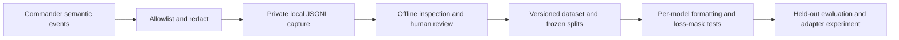

# Session capture and Commander Protocol training data

Status: **proposed implementation plan; capture/export/training are not implemented**.
Prepared 2026-09-02 against source `0.1.5`, commit `001e903`.

## Outcome

Build an opt-in, local record of real agent-to-agent communication that can be
reviewed and converted into a model-neutral dataset. Later, train and evaluate
a separate LoRA/QLoRA adapter for a selected compatible base model.

The useful deliverable is not “save everything and fine-tune.” It is an
auditable chain from observed events to approved learning examples:



No collection starts as a result of this plan. No uploads, provider transcript
imports, model downloads, training jobs, or npm release are authorized by it.

## What exists today

| Surface | Current behavior | Why it is not the dataset |
| --- | --- | --- |
| Ctrl+L diagnostic log | `~/.agents-commander/debug.log`, 1 MiB rotation plus one backup | Operational messages, not complete communication |
| F12 Activity | In-memory SEND/REPLY/BROADCAST records; defaults of 1,000 records and 8 MiB total content | Eviction, 256 KiB per-record truncation, no durable history |
| STATUS / QUERY | Live UI/controller responses | Deliberately bypass the routed-message ledger |
| Terminal panels | PTY output rendered through VTerm and scanned for frames | Redraws, echoes, secrets and missing provider context make raw output ambiguous |

Existing source anchors: `src/utils/logger.ts`,
`src/orchestration/message-ledger.ts`, `src/orchestration/orchestrator.ts`,
`src/panels/terminal-panel.ts`, and `src/agents/agent-manager.ts`.

## Scope and capture modes

Capture is off by default. Enabling payload capture must be explicit for each
launch, with an always-visible indicator and no silent persisted opt-in.

| Proposed mode | Stored | Excluded |
| --- | --- | --- |
| `off` | Nothing from the new recorder | All capture events and files |
| `metadata` | Allowlisted lifecycle, verb, route, timing, reason codes, sizes and outcomes | Bodies, arbitrary names/paths, prompts, argv and environment |
| `protocol` | Metadata plus redacted semantic bodies and actual Commander-mediated input/feedback | Unrelated terminal text, environment, arbitrary file snapshots and raw keystrokes |
| `transcript` — later, separate consent | Sanitized visible terminal output, with explicit coverage limits | Hidden provider context and password/keylogging guarantees; never part of automatic export |

Protocol mode is the recommended dataset-collection mode, but still contains
sensitive material. Metadata mode cannot produce content-training examples.
Directly typed agent input is not reliably reconstructable as semantic messages;
do not silently become a keylogger to fill that gap. Initially, use Commander’s
explicit task/template input for well-bounded training episodes.

“All session information” means all **instrumented, Commander-visible** events.
We cannot claim to capture an agent's private system prompt, hidden reasoning,
provider requests, internal tool calls, actual model identity, or full context.
Unknown fields stay unknown. User-configured model names are configuration
claims, not proof of which model the CLI actually ran.

## Event contract

Create `src/capture/` with versioned types, a non-throwing `CaptureSink`, a no-op
implementation, a redactor and a bounded writer. Inject it explicitly into the
relevant components. Do not serialize existing runtime objects wholesale or
turn the general-purpose diagnostic logger into a training recorder.

Every event is an immutable snapshot with these fields as applicable:

| Field group | Required information |
| --- | --- |
| Identity | Schema version, random capture UUID, strictly increasing per-run sequence and event ID |
| Time | UTC timestamp plus monotonic elapsed time; causal references, not timestamp sorting alone |
| Actor | Human / agent / Commander; pseudonymous session generation, stable panel address, adapter |
| Origin | Semantic observation path, explicit input provenance, synthetic/demo flag, context completeness |
| Protocol | Verb, symbolic capability reference, authorization result; **never the live key** |
| Correlation | Emission ID, namespaced message/thread IDs, resolved reply-to ID, broadcast group ID |
| Content | Optional redacted body, policy version, redaction counts, truncation/omission flags |
| Outcome | Queue admission, actual input submission, failure/timeout/drop/cancellation reason |

Project grouping uses an explicitly assigned opaque project-family ID. Do not
hash a local path and call that anonymization. Groups must survive repeated
runs and related forks for leakage-safe dataset splits, without exporting a
reversible path mapping.

### Event coverage and source hooks

| Hook | Proposed event family |
| --- | --- |
| AgentManager lifecycle | Session start, exit, restart, launch failure; generation boundaries |
| Explicit task/template/protocol entrypoints | Input intent, actual submitted input, protocol armed/rotated without key value |
| Scanner / terminal observer | Bounded malformed/oversized/echo/duplicate counters and reason codes |
| After deduplication and source authorization | Accepted semantic frame and one emission ID |
| Authorization rejection | Metadata-only rejection reason; no untrusted body by default |
| Orchestrator queues and input lanes | Enqueue/admit/reject, delivery attempt, submission result, timeout and cancellation |
| Reply-window operations | Open, claim, restore, close and resolved reply-to reference |
| STATUS / QUERY / ACK input lane | Controller intent, actual delivered response text and delivery outcome |
| Capture lifecycle | Started, paused/stopped, budget exceeded, incomplete, sealed |

Important integration rules:

- Capture accepted payloads before the ledger's lossy truncation, using separate
  documented recorder bounds. Mark oversized records incomplete; do not silently
  train on shortened protocol frames.
- Assign one `emissionId` before broadcast fan-out. All recipient deliveries
  link to it even though today's ledger creates independent recipient threads.
  Do not duplicate one assistant generation into N training completions.
- Persist the resolved REPLY window. It is the latest **open** window, with
  claim/restore behavior; panel number or nearest timestamp cannot reconstruct it.
- Distinguish controller response intent from actual input submitted. Some CLI
  feedback is flattened or width-truncated by the info-input lane.
- `delivered` means input submitted to a PTY, not accepted by the model,
  successfully reasoned about, or a completed task.
- The recorder cannot authorize, retry, launch, stop, or change routes. Capture
  failure must not change protocol behavior.

## Privacy and storage contract

1. Build records from an allowlist. Exclude capability/credential fields, full
   argv/env, arbitrary config, workspace-path fields and unrestricted error
   stacks. This structural exclusion does not guarantee that allowed free text
   contains no secret or path.
2. Replace keys with session/rotation-scoped symbolic references before writing.
   Remove known capability literals and grammar-detected embedded marker keys
   from bodies and injected prompt text too. Test nested data and boundary
   cases. Obfuscated or transformed secrets remain a filtering limitation.
3. Apply known-secret and user-defined redaction rules before persistence.
   Bound execution as well as input size: restrict custom rules to bounded
   literal replacements or a vetted linear-time matcher. Never execute arbitrary
   user regex on the routing thread; an isolated alternative needs a timeout.
   Reports record rule IDs/counts, not leaked matching values. If sanitization
   fails, omit content and degrade capture visibly.
4. Automatic filtering **does not guarantee privacy**. Code, personal data and
   unexpected secrets can remain. Export requires a separate human review and
   recorded permission to use the underlying content for the stated purpose.
5. Default storage: `~/.agents-commander/captures/<capture-uuid>/`, outside the
   project, with private directories (0700) and files (0600). Use exclusive file
   creation, owner checks and no symlink/hardlink traversal. Never write to a
   project-supplied location implicitly. File permissions are not encryption.
6. Keep captures out of git and npm packages. Add explicit ignore/pack tests,
   including tests for user-selected output paths. No telemetry or auto-upload.
7. Use append-only versioned JSONL segments and an atomically updated manifest.
   Proposed initial bounds: 16 MiB segments, 256 MiB per run, 1 MiB per event and
   4 MiB pending-write memory; tune only after stress tests. Raw transcripts, if
   added, need a separate quota. Pre-serialization validation must also be bounded.
8. On slow disk, ENOSPC, writer failure or quota exhaustion, stop capture and show
   `REC:INCOMPLETE`; continue Commander. Reserve accounting capacity, but do not
   promise an on-disk error record when the disk itself is unavailable. The
   absence of a successfully flushed completion marker means incomplete.
9. Offer explicit inspect/export/prune operations. Cleanup defaults to dry-run;
   only operator-confirmed, recorder-owned, closed runs can be removed. No
   automatic deletion of live runs or unreviewed research data. A proposed
   30-day review reminder is documentation, not a scheduled task.

### Crash and shutdown behavior

Use a dedicated lifecycle subscription: App currently removes its UI listener
before emitting shutdown exits. The recorder must survive those events.

Shutdown order: stop new inputs and seal route admission; settle/cancel queued
work with explicit terminal outcomes; finish session-exit events; close capture
subscriptions; bounded flush/fsync; then write the completed manifest and exit.
Implement an explicit orchestrator seal/drain contract rather than assuming
App.dispose currently drains every asynchronous lane. A timeout remains an
incomplete capture; never block shutdown indefinitely.

Offline validation may recover complete JSONL records before a partial final
line, retaining the incomplete status. It must never execute captured text,
write into a live PTY, or reconstruct live authorization capabilities. Escape
terminal control sequences in viewers; quarantine unsupported schema versions.

## From events to training examples

Keep captures immutable. Review annotations, normalization manifests and exports
are separate versioned artifacts with source event references.

Each example has one focal agent and one reviewed next response:

```text
example_id, recipe_version, focal_agent, objective
prompt: normalized context messages
completion: one focal-agent assistant response
sidecar: source event IDs, grouping, review, rights, privacy and transformations
```

- Earlier output from the focal agent is assistant context, not a new target.
  Incoming peers are explicitly labelled external-agent input; ACKs and query
  results are controller feedback. Never merge all agents into one assistant.
- Do not upgrade peer text to a trusted system instruction. Portable exports
  can use labelled user-context blocks. Native tool-call roles require genuinely
  captured tool interactions and a compatible template; Commander text frames
  are not native API tool calls.
- Record coverage as `commander-visible`, `missing-manual-input`, `truncated`,
  etc. Missing context is not invented. Added protocol instructions are tagged
  as synthetic conditioning, not represented as captured provider prompts.
- A delivered frame is a candidate, not a positive quality label. Require review
  of protocol correctness, relevant context, task usefulness and data permissions.
- Exclude echoed/duplicate, malformed, unauthorized, incomplete and truncated
  examples from the initial positive set. Preserve failure metadata for analysis.
  Valid repairs after feedback can become separately reviewed recovery examples.
- Infrastructure failures are not automatic “bad model” labels. Do not derive
  DPO chosen/rejected pairs from delivery status; preference pairs need the same
  prompt and a meaningful reviewed preference.
- Label deterministic demo fixtures as synthetic and keep them separate from
  claims about real-agent collaboration or task quality.

### Two export recipes, not one ambiguous format

`commander-wire-v1` is the first target: complete protocol output with the
current grammar. Canonical records contain symbolic capabilities. During
export, generate a non-secret export seed and derive distinct format-valid
synthetic keys for each `(example, session generation, capability rotation)`.
Reuse each binding consistently in conditioning/header/footer, including
historical context. Freeze the seed and normalization version in the private
manifest so a repeat export is deterministic. Never derive synthetic keys from
real capabilities. Test that A/B and old/current keys stay distinct, and assess
key-copy generalization on unseen synthetic keys. Do not export a known live
key or teach a literal placeholder as a usable runtime capability.

`collaboration-body-v1` is optional later: train useful delegation, challenge
and refinement bodies. It requires an explicit runtime renderer/wrapper to
create wire frames and is not interchangeable with direct CLI protocol output.

### Splitting and reproducibility

Assign train/validation/test membership before deriving windows or augmentation.
Keep complete project families, task episodes, both sides of handoffs, broadcasts,
retries and near-duplicates in one split. Prefer held-out projects and a later
time period. A one-project pilot supports only a narrower task/time-held-out
claim. Keep benchmark fixtures out of the training collection.

Export a dataset card, source manifest, content/recipe checksums, exclusions,
review policy and split assignment. Keep identifying review metadata in a
private sidecar. Permission to use Commander does not establish permission to
train on every project's code or every provider's output.

### Model-specific training is a later gate

Use conversational prompt/completion exports. TRL supports this format and
completion-only loss; assistant-only loss additionally requires a compatible
generation mask. Test the decoded supervised tokens, nonzero target length,
complete END marker, EOS and absence of loss on context/metadata/padding.
Initially disable packing. [TRL SFT Trainer](https://huggingface.co/docs/trl/sft_trainer)

Pin base-model revision, tokenizer, template hash and toolchain versions. Apply
the chosen chat template exactly once; do not bake one model's control tokens
into the canonical dataset. [Transformers chat templates](https://huggingface.co/docs/transformers/chat_templating)

LoRA and QLoRA are later experimental choices. The portable component is the
dataset and its exporters, **not one adapter that works with any LLM**. Adapter
weights depend on a compatible base architecture/revision and serving stack;
closed/API-only models cannot simply load an arbitrary local adapter.
[PEFT checkpoint format](https://huggingface.co/docs/peft/developer_guides/checkpoint),
[LoRA](https://arxiv.org/abs/2106.09685), [QLoRA](https://arxiv.org/abs/2305.14314)

## Implementation sequence and acceptance gates

Each major implementation phase gets pre-change CR, focused tests, full
`npm run verify`, post-change CR and a scoped commit/push. Pushing source is not
an npm publication. Keep training dependencies out of the terminal application.

| Phase | Work | Acceptance gate |
| --- | --- | --- |
| 0 — docs and design | Resolve the documentation audit, approve capture scope/schema and create synthetic fixtures | Current source vs public package is unambiguous; security/schema CR passes |
| 1 — recorder core | No-op sink, private writer, modes, budget, manifest, recovery, visible status | Disabled mode creates no capture files; failures cannot stall routing; filesystem tests pass |
| 2 — semantic integration | Lifecycle, five verbs, authorization, broadcast/reply correlation, actual feedback, explicit task context and shutdown drain | Deterministic end-to-end event trace is complete; no secret fixtures persist; routing behavior unchanged |
| 3 — dataset tools | Offline inspect/validate, annotations, approved export, split/normalization manifests and test harness | Golden export/mask tests pass; incomplete or unapproved data cannot enter the gold set |
| 4 — real-data pilot | Explicitly approved protocol capture on a permissioned project; manually review a small diverse sample | All five verbs/recovery cases assessed; rights/privacy review; no quality claim from counts alone |
| 5 — adapter experiment | Select one compatible base model and hardware budget; compare prompted base vs LoRA (then optionally QLoRA) | Frozen held-out evaluation; separately approved compute/downloads; publish no dataset by default |
| Optional — transcripts | Separate opt-in visible-output capture with retention and coverage limits | Additional security/performance review; excluded from automatic dataset export |

Proposed files: `src/capture/{types,sink,redactor,writer,manifest}.ts`,
`src/dataset/{validate,normalize,group,export}.ts`, capture/dataset CLI routing,
and focused unit/integration/built-package tests. Names are design targets,
not claims that those modules already exist.

Proposed UX (not current commands): launch with `--capture metadata` or
`--capture protocol`; show `REC:METADATA`, `REC:PROTOCOL`, or `REC:INCOMPLETE`
with event/byte counts and destination; expose details from Activity without
taking an existing shortcut. Offline commands should use an explicit namespace
such as `agents-commander capture inspect <id>`. Specify subcommand/directory
argument compatibility before adding it to the current CLI parser.

## Validation matrix

- All five verbs; correct ACK intent vs actual submitted text; bounded QUERY
  response; delivery status distinct from task correctness.
- Broadcast emission grouping; multiple open REPLY windows; failed-reply restore;
  restarts, stale targets, stable panel IDs and capability rotation.
- Echo/grid/scrollback/tail dedup; malformed and oversized frames; Unicode
  boundaries; immutable snapshots; nested secrets and unsupported schemas;
  adversarial redaction-performance cases and timeout/omit-content behavior.
- Queue admission/rejection, timeout, cancellation, disk stalls/full disk,
  per-event/run/memory bounds, concurrent independent runs and path attacks.
- Normal exit, SIGINT/SIGTERM, startup rollback, route-drain timeout and abrupt
  termination; partial final record recovered as incomplete.
- No capture files when off; no recording by importing library or running help;
  no captures in git/npm package; no automatic network activity from recorder.
- One focal response per example; broadcast not multiplied; no context/mask
  leakage; cross-split near-duplicates; exact provenance and deterministic export.
- Evaluation: parse rate, correct verb/target/key/footer, REPLY semantics, recovery,
  unsolicited actions, privacy canaries and independent task-quality review.
  Measure model behavior separately from controller guards blocking bad output.

## Decisions before implementation / collection

Recommended baseline: protocol-first, launch-only consent, no raw keystrokes,
local storage, no automatic deletion/upload, and a reviewed gold export.
The first model and hardware are intentionally undecided until there is a
useful, approved dataset. Broader transcript capture is a separate decision.

Supporting research: [TRL dataset formats](https://huggingface.co/docs/trl/dataset_formats),
[PEFT quantization](https://huggingface.co/docs/peft/developer_guides/quantization),
[deduplication research](https://arxiv.org/abs/2107.06499),
[training-data extraction risk](https://arxiv.org/abs/2012.07805),
[Datasheets for Datasets](https://arxiv.org/abs/1803.09010).
